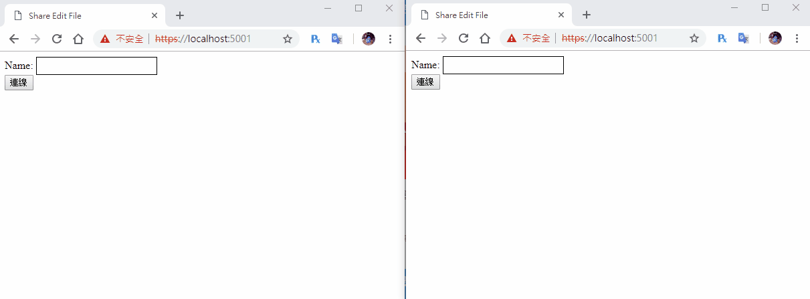

今天就來完成最後的部分吧！最後要載入和建立自訂的文件，首先來先來做建立的部分

# 建立自訂文件
首先先建立切換畫面事件，讓建立文件的Button能切換頁面

``` js
goCreateFileBtn.addEventListener('click',function(){
    // 切換成建立文件選擇畫面
    fileListDiv.style.display = 'none';
    createFileDiv.style.display = '';
});
```
## 建立文件畫面
再來是建立文件的畫面
``` html
<button id="cancelCreateFile" type="button" >取消</button><br><br>
文件名稱：<input id="newFileName" type="text"  class="input"><br><br>
欄位數：<input id="newCol" type="text"  class="input"><br><br>
列位數：<input id="newRow" type="text"  class="input"><br><br>
<button id="createFileBtn" type="button">建立文件</button><br>
```
讀取DOM
``` js
var cancelCreateFile = document.getElementById('cancelCreateFile');
var createFileBtn = document.getElementById('createFileBtn');
```
## 建立新增文件事件
新增取消建立文件按鈕事件，讓他返回文件選擇畫面
``` js
cancelCreateFile.addEventListener('click',function(){
    // 切換成文件選擇畫面
    createFileDiv.style.display = 'none';
    fileListDiv.style.display = '';
});
```
新增建立按鈕事件，把Form的資料都丟回去就行，接收部分一樣是`connection.on("ReceiveUserList")`，昨天已經建立了，所以就不需要接收事件了，成功後用`.then()`切換畫面，因為`connection.on("ReceiveUserList")`不只有建立文件時接收，所以改成`.then()`裡面。
``` js
createFileBtn.addEventListener('click', function () {
    var newFileName = document.getElementById('newFileName').value;
    var newRow = document.getElementById('newRow').value;
    var newCol = document.getElementById('newCol').value;

    connection.invoke("CreateFile", newFileName, newCol, newRow).then(function(){
        // 切換成文件列表畫面
        createFileDiv.style.display = 'none';
        fileListDiv.style.display = '';
    }).catch(function (err) {
        return console.error(err.toString());
    });
});
```

再來到後端的`FileHub`引用泛型和`Models`
``` cs
using System.Collections.Generic;
using EditFileWeb.Models;
```
然後到建立一個方法`CreateFile`，內容跟之前建立測試文件一樣，只要把內容換成前端Form傳回的值就行
``` cs
public async Task CreateFile(string fileName, int col, int row)
{
    var fileModel = new FileModel();
    fileModel.creator = Context.ConnectionId;
    fileModel.filename = fileName;
    fileModel.row = row;
    fileModel.column = col;
    fileModel.editor = new List<UserModel>();
    List<CellModel> textList = new List<CellModel>();
    for (int i = 0; i < col; i++)
    {
        for (int j = 0; j < row; j++)
        {
            var cellModel = new CellModel();
            cellModel.lockState = true;
            cellModel.text = "";
            cellModel.cellName = $"{i}{j}";
            textList.Add(cellModel);
        }
    }
    fileModel.textList = textList;
    _service.AddFile(fileModel);

    await Clients.All.SendAsync("ReceiveFileList", _service.GetFileList());
}
```

# 讀取文件部分修改
讀取文件的按鈕事件，先把讀曲中的`LoadFile`換成選擇的`fileName`，再來因為我們已經多了名稱的機制，所以讀取文件時多傳一個`name`回去
``` js
// 取得文件按鈕事件
getFileBtn.addEventListener('click', function () {
    // 去得選擇文件的名稱
    var fileName = document.getElementById('fileList').value;
    // 使用中的文件變數
    LoadFile = fileName;

    connection.invoke("GetFile", fileName, name).catch(function (err) {
        return console.error(err.toString());
    });
});
```

建立表格的方式我們不需要改，只需加入切換畫面就好
``` js
connection.on("ReceiveFile", function (file) {
    // 切換成文件編輯畫面
    fileListDiv.style.display = 'none';
    fileDiv.style.display = '';

    // 建立文件
    // 略....

});
```
## 使用者清單改用名稱顯示
`connection.on("ReceiveUserList")`改成使用`name`來判斷是不是自己，塞進去的名稱也改成`name`
``` js
connection.on("ReceiveUserList", function (userListData) {
    userList.innerHTML = '';
    for (var i = 0; i < userListData.length; i++) {
        var user = document.createElement('span');
        user.id = userListData[i].id;
        user.className = 'user';
        var userColor = document.createElement('div');
        userColor.className = 'userColor';
        userColor.style.backgroundColor = userListData[i].color;
        user.appendChild(userColor);
        if (name == userListData[i].name)
            user.append('自己');
        else
            user.append(userListData[i].name);
        userList.appendChild(user);
    }
});
```
後端也需要修改，首先是`FileService`的`AddUser`，需要增加一個使用者名稱變數`name`，然後塞進`UserModel`容器內。
``` cs
public bool AddUser(string fileName, string id, string name)
{
    // 找出哪個file
    var file = (from f in list where f.filename == fileName select f).FirstOrDefault();
    var userModel = new UserModel();
    var rnd = new Random();
    userModel.id = id;
    userModel.name = name;
    // 顏色隨機產生
    userModel.color = $"rgb({rnd.Next(0, 255)}, {rnd.Next(0, 255)}, {rnd.Next(0, 255)})";
    file.editor.Add(userModel);
    return true;
}
```
再來`FileHub`部分，也是多一個名稱變數，在新增進去就行。
``` cs
public async Task GetFile(string fileName, string name)
{
    // 取得文件
    var file = _service.GetFile(fileName);
    // 加入使用者
    _service.AddUser(fileName, Context.ConnectionId, name);

    await Clients.Caller.SendAsync("ReceiveFile", file);
    await Clients.All.SendAsync("ReceiveUserList", _service.GetUserList(fileName));
}
```
這樣就大功告成啦！！！

# DEMO


做完這邊發現有不少BUG，明天再來把這些小BUG慢慢地修正完成！


